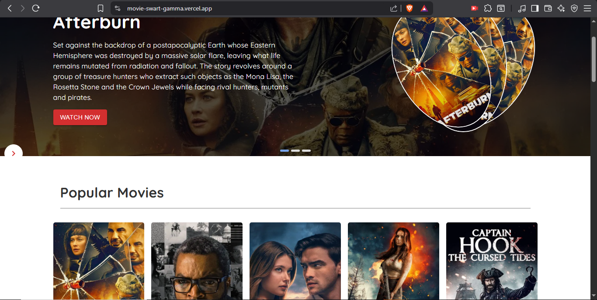

# Random Movies



## Project Overview

This project is a React web application for discovering movies and TV shows using The Movie Database (TMDB) API. It offers browsing, detailed view pages, caching, and a responsive interface.

## Features

- Browse popular movies and trending TV shows
- View detailed information for selected titles
- Search for movies and TV shows
- Filter content by genre
- LocalStorage caching for faster load times
- Pagination for large result sets
- Responsive layout for desktop and mobile

## Technology stack

- React 18.3
- React Router 6
- Material UI (MUI) 6
- React Query (TanStack Query)
- Axios
- React Hook Form
- Yup
- React Spinners
- React Loader Spinner

## Project structure

```text
movie/
├── public/
│   ├── assets/
│   │   └── cover/
│   ├── detail.css
│   ├── index.html
│   ├── Slider.css
│   └── style.css
├── src/
│   ├── api/
│   │   ├── axios.js
│   │   ├── endpoints.js
│   │   ├── fetchWithCache.js
│   │   └── getGenres.js
│   ├── components/
│   │   ├── card/
│   │   │   ├── card.js
│   │   │   └── cardAllItem.js
│   │   ├── ui/
│   │   │   ├── header.js
│   │   │   └── loadingSpin.js
│   │   ├── footer.js
│   │   ├── navbar.js
│   │   └── Slide.js
│   ├── hooks/
│   │   └── useFetch.js
│   ├── routes/
│   │   └── routes.js
│   ├── service/
│   │   ├── MovieDetails.js
│   │   ├── TvDetails.js
│   │   ├── TvShows.js
│   │   ├── anime.js
│   │   ├── home.js
│   │   └── movies.js
│   ├── utils/
│   │   └── genreUtils.js
│   └── index.js
├── build/
│   ├── asset-manifest.json
│   ├── index.html
│   ├── Slider.css
│   ├── style.css
│   └── assets/
│       └── cover/
├── package.json
├── README.md
├── .env
└── vercel.json
```

## Getting started

### Prerequisites

- Node.js 14 or newer
- npm

### Install dependencies

```bash
npm install
```

### Run the application

```bash
npm start
```

The app will run at http://localhost:3000 by default.

## Configuration

The TMDB API key is included in `src/api/axios.js`. For a production setup, move the key to an environment variable and update the configuration to read from it.

## Available scripts

- `npm start`: Start the development server
- `npm build`: Build the app for production
- `npm test`: Run tests

## How it works

- `src/index.js` initializes React and React Query.
- `src/routes/routes.js` defines main page routes.
- `src/service/home.js` and `src/service/movies.js` fetch and display movie and TV show lists.
- `src/service/MovieDetails.js` and `src/service/TvDetails.js` display detailed pages.
- `src/api/axios.js` configures Axios with the TMDB API base URL.
- `src/api/fetchWithCache.js` caches API responses in localStorage.
- `src/hooks/useFetch.js` provides a reusable data-fetching hook.

## Deployment

Build the app with:

```bash
npm run build
```

Deploy the `build/` directory to a static hosting service or Vercel.

## Notes

- The project uses TMDB API endpoints.
- Caching is stored in the browser's localStorage.
- The UI is built with Material UI components.

## Future improvements

- Add authentication and user profiles
- Add a watchlist or favorites feature
- Add a dark mode theme
- Add more advanced search and filtering
- Convert to a progressive web app
